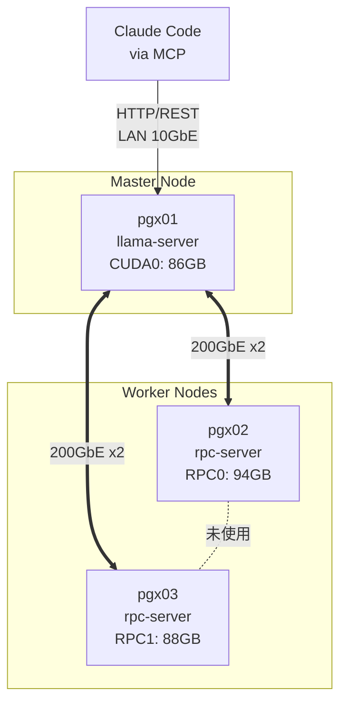

自宅にGPUクラスタを構築し、超巨大モデルを運用する。ロマンがありますね。

今回は、自宅にある3台の **Lenovo ThinkStation PGX**（中身はNVIDIA DGX Spark相当）を200GbEで接続し、**Qwen3.5-397B**（Q5_K_M量子化）を動作させ、Claude Codeのサブエージェントとして実用化することに成功しました。

ハードウェア構成からソフトウェアの落とし穴まで、構築の全貌を共有します。

---

## 1. 結果：実用になったのか？

結論から言うと、**実用運用できています。**

ThinkStation PGX 3台を使った分散推論により、パラメータ数397B（MoE Active 17B）の超巨大モデルが動作しました。現在は、Anthropic社が提供するCLIツール **Claude Code** のバックエンド（コーディング担当サブエージェント）として組み込んでいます。

- **モデル**: Qwen3.5-397B-A17B-Instruct (Q5_K_M GGUF)
- **生成速度**: 約 11 tokens/s
- **コンテキスト**: 256K 対応

「11 tok/s」と聞くと遅く感じるかもしれませんが、コーディングタスクにおいては、Claude Codeがオーケストレーターとして振る舞い、裏でQwenが重いコード生成を行うため、体感としては「思考している間にコードが書かれている」感覚で、十分に実用的です。

構成は以下の通りです。
`Claude Code (Client)` → `MCP (OpenAI Compatible)` → `llama.cpp (Server)` → `3-Node Cluster`

## 2. なぜやったのか？

最大の理由は **「Claude CodeのAPI課金への対抗」** です。
Claude Codeは非常に便利ですが、エージェントとして自律的に何度も推論を行うため、トークン消費量が膨大になります。特にコード生成部分はトークン数が嵩むため、ここをローカルLLMにオフロードしたいと考えました。

あと、最初に書いた通り「でかいモデルを手元で動かす」というロマンが、モチベーションの大部分を占めています。

## 3. ハードウェア構成

Lenovo ThinkStation PGXは、NVIDIA DGX Sparkをベースにしたデスクトップ向けAIプラットフォームです。中身はDGX Sparkと同一です。

- **ノード数**: 3台（Lenovo ThinkStation PGX）
- **SoC**: NVIDIA GB10 (Blackwell architecture, aarch64)
- **CPU**: Cortex-X925 20コア
- **メモリ**: 128GB 統合メモリ (LPDDR5X) / 台
  - **合計メモリ**: 384GB
- **ネットワーク (各台)**:
  - ConnectX-7 200GbE x 2ポート (QSFP56)、OS上は4つの論理NICとして認識
  - 10GbE LAN x 1ポート (管理用)

**メモリ計算:**
Qwen3.5-397BのQ5_K_M量子化モデルは約 **262GB** です。
3台合計 **384GB** の容量があるため、モデルを展開しても約 **122GB** の余白があり、これをKVキャッシュ（コンテキスト長）に割り当てることで、長文のコード解析も可能になります。

## 4. ソフトウェア構成

推論エンジンには、分散推論に定評のある `llama.cpp` を採用しました。

- **推論エンジン**: llama.cpp (llama-server)
- **分散方式**: llama.cpp RPC backend (レイヤー分割)
- **OS/ドライバ**: Ubuntu / NVIDIA Driver 580.126.09 / CUDA 13.0
- **API**: OpenAI互換エンドポイント (`http://<master-ip>:8080/v1`)
- **クライアント**: `openai-mcp-server` を介して Claude Code に接続

起動には約16分かかりますが、一度立ち上げてしまえば安定して動作します。

## 5. クラスタ構成図

各ノードにはConnectX-7 200GbE x 4ポートが搭載されています。当初はフルメッシュ接続（6リンク）を構成しましたが、llama.cppのRPC通信はMaster（pgx01）とWorker間のみで発生するため、**Worker同士のリンク（pgx02↔pgx03）は実質未使用**でした。結果として、実効トポロジはpgx01をハブとしたスター型になっています。

### ConnectX-7の物理・論理インターフェース構成

ここが少しややこしいポイントです。各PGXの背面にはQSFPポートが **2基**（物理ポート）ありますが、OS上では **4つのNIC**（論理インターフェース）として認識されます。これはGB10チップとConnectX-7の接続が「2系統のPCIe Gen5 x4」に分かれているためで、物理1ポートの帯域が内部的に2つのPCIe接続に分割されています。つまり、ケーブルを1本挿すと論理NICが2つリンクアップします。

この構成の詳細は[こちらの記事](https://qiita.com/ksasaki/items/bd88ff8c03760856fe6c)が参考になります。

フルメッシュで全ペア間を接続しましたが、llama.cppのRPC通信で実際に使うのはpgx01↔02、pgx01↔03間で各1論理インターフェースのみ。結果として **4つの論理インターフェースが遊んでいる** 状態です。物理ケーブルとしてはpgx02↔pgx03間の1本が完全に無駄になっています。これから構築する方はスター型で十分です。



- **pgx01 (Master)**: 推論のエントリーポイント。自身のVRAMも使いつつ、RPC経由で各Workerを制御。
- **pgx02/03 (Workers)**: `llama-rpc-server` が常駐し、計算リソースを提供。
- **pgx02↔pgx03**: 物理的には200GbE x2で接続済みだが、RPC通信では使われない。

## 6. インストール手順（概要）

構築の要点のみを抜粋します。

### ネットワーク設定 (Netplan)
ConnectX-7の各ポートでジャンボフレーム (MTU 9000) を有効にし、各ノード間で直結通信できるようにIPを割り当てます。

```yaml
# /etc/netplan/40-cx7.yaml (例)
network:
  version: 2
  ethernets:
    enp1s0f0np0:
      addresses: [10.0.0.1/24]
      mtu: 9000
    # ... (各ポート設定)
```

### Worker側 (pgx02, pgx03)
llama.cppをビルドし、RPCサーバーをsystemdでサービス化します。

```ini
# /etc/systemd/system/llama-rpc-server.service
[Unit]
Description=Llama CPP RPC Server
[Service]
ExecStart=/usr/local/bin/llama-rpc-server -H 10.0.0.2 -p 50052
Restart=always
[Install]
WantedBy=multi-user.target
```

### Master側 (pgx01)

```bash
# 起動スクリプトイメージ
./llama-server \
  -m models/Qwen3.5-397B-Q5_K_M.gguf \
  --rpc 10.0.0.2:50052,10.0.2.2:50052 \
  -c 32768 -ngl 999 --host 0.0.0.0 --port 8080
```

### Claude Code側
MCPサーバー設定に `openai-mcp-server` を追加し、`OPENAI_BASE_URL` を自宅サーバーに向けます。

## 7. 詰まったポイント

ここが最も共有したい部分です。397Bクラスの構築は一筋縄ではいきませんでした。

### 2ノード（256GB）ではQ5_K_Mが動かない
当初、2台で試みましたが、メモリ不足でクラッシュしました。
Q4_K_M (241GB) なら256GBに収まりそうに見えますが、推論時のKVキャッシュやテンポラリバッファを含めると溢れます。Q5_K_Mでの運用には**3台（384GB）構成は必須**でした。

一時期はQ3_K_Mまで量子化を落とし、2台構成で運用していた時期もあります。メモリには収まりますが、コード生成の品質低下が顕著でした。オーケストレーター（Claude Code）がQwen3.5の生成コードをレビューして修正する構成なのですが、Q3_K_M時代はレビューというよりほぼリライト状態で、サブエージェントに委託する意味が薄れていました。3台目を追加してQ5_K_Mに上げてからは品質が明確に改善し、ようやく「委託」として機能するようになりました。量子化の差は397Bクラスでも無視できません。

### vLLMへの移行は時期尚早
高速な `vLLM` を使いたかったのですが、以下の理由で断念しました。
- GGUFのロードが非常に遅い（llama.cpp比で8倍）
- GB10チップ (Compute Capability SM121) への最適化がまだ不安定
- AWQ量子化版のQwen3.5モデルがまだ提供されていない

現時点では `llama.cpp` が最も安定かつセットアップが容易です。

### GPU使用率が40%程度しか出ない
推論中、GPU使用率が低いことが若干気になっています。
Qwen3.5は **MoE (Mixture of Experts)** モデルです。総パラメータは397Bですが、推論時にアクティブになるのは約17Bのみ。しかし、毎回異なるエキスパート（重み）をメモリからロードする必要があるため、計算性能（Compute）よりも **メモリ帯域幅（Bandwidth）がボトルネック** になって、GPUコアが遊んでいるように見えるようです。

### Speculative Decoding（投機的デコーディング）の罠
生成速度向上の切り札である Speculative Decoding ですが、llama.cpp の Qwen3.5 対応はまだ不完全です（Issue #20039）。設定してもエラーを出さずにサイレントにフォールバックされるため、速度が出ない原因の特定に時間を要しました。Qwen3.5独自機能である MTP (自己投機的デコーディング) も、llama.cpp では未対応です。

## 8. ベンチマーク

実際の運用数値です。

| 項目 | 値 |
|---|---|
| 生成速度 | 約 11 tok/s |
| モデルロード時間 | 約16分 |
| VRAM使用 (pgx01) | 86 GB |
| VRAM使用 (pgx02) | 94 GB |
| VRAM使用 (pgx03) | 88 GB |
| 合計VRAM | 約 268 GB |
| GPUオフロード | 全61レイヤー |
| 同時リクエスト | 1（品質優先） |

シングルリクエスト（バッチサイズ1）での運用ですが、コード生成の品質は極めて高く、速度も思考を妨げないギリギリのラインを維持しています。

### 言語による速度差

実測したところ、生成速度（tok/s）自体は言語によらずほぼ一定でした。

| タスク | 生成速度 | 1トークンあたり文字数 |
|---|---|---|
| 英語コード生成 | 11.3 tok/s | - |
| 日本語文章生成 | 11.3 tok/s | 約1.4文字 |

トークナイザレベルでの処理速度は同じですが、日本語は1トークンあたりの文字数が少ないため、体感の「文章が出てくる速さ」は英語より少し遅く感じます。コード生成がメインユースケースなので、実用上は問題ありません。

### ノード間ネットワーク帯域

iperf3で200GbEリンクの実効帯域を計測しました（4並列ストリーム、MTU 9000）。

| テスト条件 | pgx01→pgx02 | pgx01→pgx03 | 合計 |
|---|---|---|---|
| 個別通信 | 110 Gbps | 111 Gbps | - |
| 同時通信 | 101 Gbps | 99 Gbps | 200 Gbps |

個別では各リンク約110 Gbps、同時通信でも各100 Gbps前後を維持しており、合計約200 Gbpsの帯域を確保できています。同時通信時の低下は約10%程度で、pgx01→pgx02とpgx01→pgx03が別々の物理ポート・PCIeレーンを使用しているため、干渉はほとんどありません。

なお200GbEリンクの理論値に対して110 Gbps（55%）に留まるのは、先述のPCIe Gen5 x4の帯域（約128 Gbps）がボトルネックになっているためです。ConnectX-7の200Gbpsフル性能を引き出すには、Qiita記事で紹介されているように2つの論理NICを束ねる構成が必要ですが、llama.cppのRPC通信では単一NICしか使わないため、現状はこれが上限となっています。

## 9. まとめ

ThinkStation PGX 3台とllama.cppのRPC機能を組み合わせることで、**397Bクラスの超巨大モデルを自宅で実用運用**することができました。

- **Claude Codeのサブエージェントとして優秀**: 財布を気にせずコードをガリガリ書かせられるのは精神衛生上非常に良い
- **速度は許容範囲**: 11 tok/s は爆速ではないが、品質とのトレードオフとして納得感がある
- **今後の課題**: 半年後を目安に、vLLMが成熟したら移行し、Speculative Decodingによる高速化を狙いたい

自宅に眠っている高性能デバイスがある方は、ぜひローカル大規模クラスタに挑戦してみてください。そこにはロマンと実益の両方があります。
